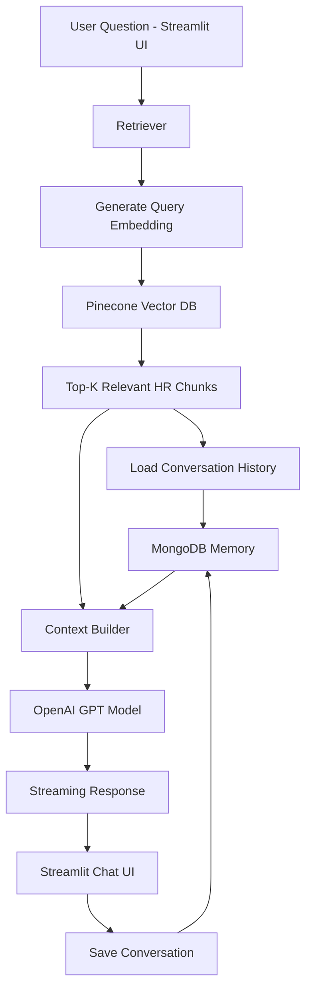

# HR RAG Assistant with Persistent Memory

An AI-powered HR policy assistant built using **Retrieval-Augmented Generation (RAG)**.
The system retrieves relevant information from company HR documents and generates accurate answers using an LLM.

The assistant supports **persistent conversational memory**, allowing it to remember previous messages within a session.

---

# Features

* HR document question answering
* Retrieval-Augmented Generation (RAG)
* Vector search using Pinecone
* OpenAI embeddings for semantic search
* GPT-based answer generation
* Persistent chat memory using MongoDB
* Streamlit interactive chat interface
* Streaming responses from the LLM
* Context debugging mode

---

# Tech Stack

| Component       | Technology                    |
| --------------- | ----------------------------- |
| LLM             | OpenAI GPT                    |
| Embeddings      | OpenAI text-embedding-3-small |
| Vector Database | Pinecone                      |
| Memory          | MongoDB                       |
| Backend         | Python                        |
| UI              | Streamlit                     |
## System Architecture



This architecture shows how the system combines **RAG retrieval with persistent conversation memory** to answer HR policy questions.

---

# Project Architecture

User Question
↓
Retrieve relevant HR document chunks from Pinecone
↓
Load recent conversation history from MongoDB
↓
Combine **history + retrieved context + user question**
↓
Send prompt to OpenAI GPT
↓
Stream response to Streamlit UI

---

# Project Structure

```
hr-rag-assistant-persistent-memory
│
├── data/
│   └── COMPANY HR POLICY MANUAL.txt
│
├── rag/
│   ├── embedder.py
│   ├── loader.py
│   └── retriever.py
│
├── memory/
│   └── mongo_memory.py
│
├── llm/
│   └── openai_client.py
│
├── streamlit_app.py
├── build_index.py
├── pine_index.py
├── config.py
└── requirements.txt
```

---

# How It Works

### 1. Document Loading and Chunking

HR documents are loaded from the `data` directory and split into smaller chunks for efficient retrieval. 

### 2. Embedding Generation

Each chunk is converted into vector embeddings using OpenAI's embedding model. 

### 3. Vector Storage

Embeddings are stored in a Pinecone vector database for fast semantic search. 

### 4. Retrieval

When a user asks a question, the system retrieves the most relevant document chunks from Pinecone. 

### 5. Conversation Memory

User messages and assistant responses are stored in MongoDB to maintain conversation history. 

### 6. LLM Response Generation

The retrieved context, conversation history, and the user's question are sent to the OpenAI model to generate the final response. 

---

# Installation

Clone the repository:

```
git clone https://github.com/Selvasaranya2025/hr-rag-assistant-persistent-memory.git
cd hr-rag-assistant-persistent-memory
```

Create virtual environment:

```
python -m venv venv
venv\Scripts\activate
```

Install dependencies:

```
pip install -r requirements.txt
```

---

# Environment Variables

Create a `.env` file:

```
OPENAI_API_KEY=your_openai_key
PINECONE_API_KEY=your_pinecone_key
MONGO_URI=mongodb://localhost:27017/
```

---

# Build Vector Index

Before running the app, create the Pinecone index and upload document embeddings.

```
python pine_index.py
python build_index.py
```

---

# Run the Application

```
streamlit run streamlit_app.py
```

Then open:

```
http://localhost:8501
```

---

# Example Questions

* What is the annual leave policy?
* What is the notice period?
* What does health insurance cover?

---

# Future Improvements

* Multi-document support
* Role-based HR access
* Source citation for answers
* Docker deployment
* Authentication for employees

---

# Author

Saranya
Data Science & AI Enthusiast
